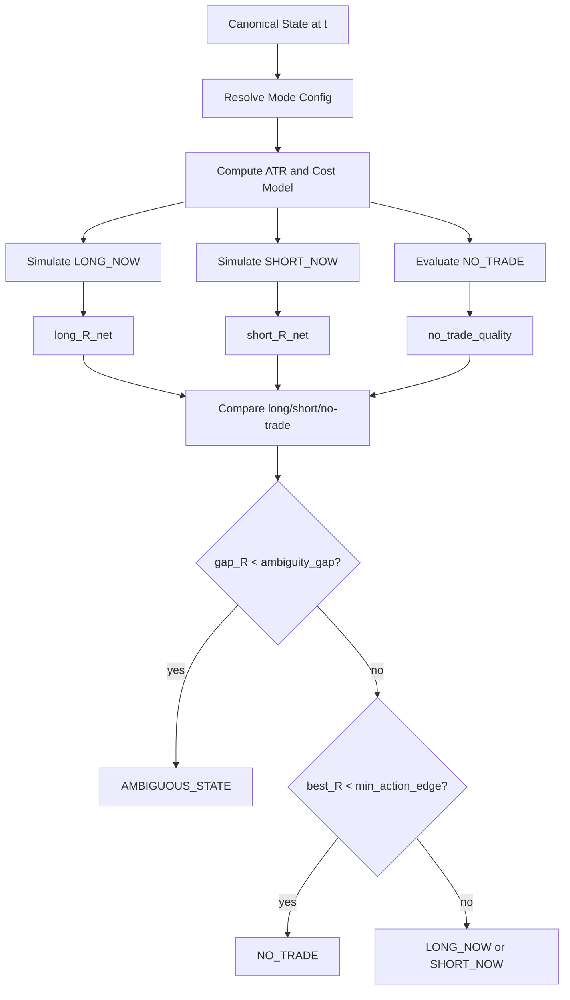

# Label Generation Diagram

```mermaid
flowchart TD
    A[Canonical State at t] --> B[Resolve Mode Config]
    B --> C[Compute ATR and Cost Model]
    C --> D[Simulate LONG_NOW]
    C --> E[Simulate SHORT_NOW]
    C --> F[Evaluate NO_TRADE]
    D --> G[long_R_net]
    E --> H[short_R_net]
    F --> I[no_trade_quality]
    G --> J[Compare long/short/no-trade]
    H --> J
    I --> J
    J --> K{gap_R < ambiguity_gap?}
    K -- yes --> L[AMBIGUOUS_STATE]
    K -- no --> M{best_R < min_action_edge?}
    M -- yes --> N[NO_TRADE]
    M -- no --> O[LONG_NOW or SHORT_NOW]
```
