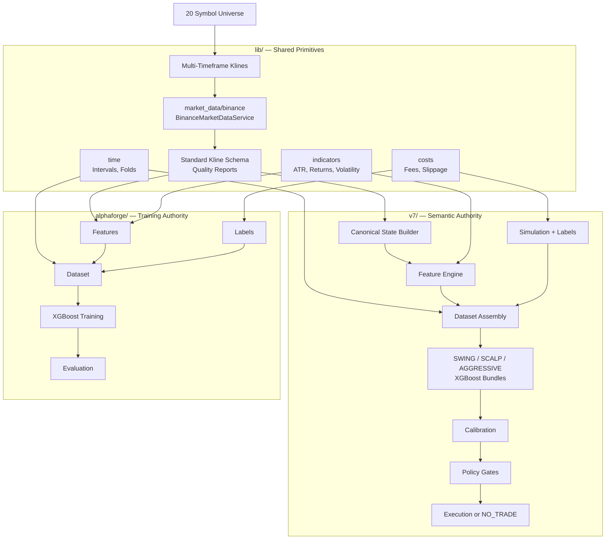
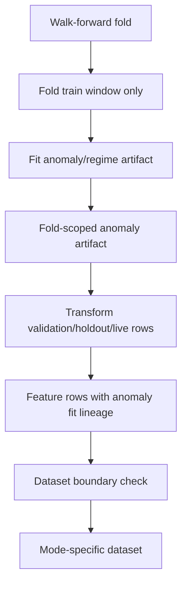

# Architecture Diagram

```mermaid
flowchart TD
    A[20 Symbol Universe] --> B[Multi-Timeframe Klines]
    
    subgraph LIB["lib/ — Shared Primitives"]
        B --> MDS[market_data/binance\nBinanceMarketDataService]
        MDS --> KS[Standard Kline Schema\nQuality Reports]
        IND[indicators\nATR, Returns, Volatility]
        COST[costs\nFees, Slippage]
        TIME[time\nIntervals, Folds]
    end

    subgraph V7["v7/ — Semantic Authority"]
        KS --> CS[Canonical State Builder]
        CS --> FEAT[Feature Engine]
        IND --> FEAT
        COST --> SIM[Simulation + Labels]
        TIME --> DS[Dataset Assembly]
        FEAT --> DS
        SIM --> DS
        
        DS --> MODELS[SWING / SCALP / AGGRESSIVE\nXGBoost Bundles]
        MODELS --> CAL[Calibration]
        CAL --> POLICY[Policy Gates]
        POLICY --> EXEC[Execution or NO_TRADE]
    end

    subgraph AF["alphaforge/ — Training Authority"]
        KS --> AF_FEAT[Features]
        IND --> AF_FEAT
        COST --> AF_LAB[Labels]
        TIME --> AF_DS[Dataset]
        AF_FEAT --> AF_DS
        AF_LAB --> AF_DS
        AF_DS --> AF_MODEL[XGBoost Training]
        AF_MODEL --> AF_EVAL[Evaluation]
    end
```

## Review-hardened anomaly lineage

```mermaid
flowchart TD
  Fold[Walk-forward fold] --> TrainWindow[Fold train window only]
  TrainWindow --> FitAnomaly[Fit anomaly/regime artifact]
  FitAnomaly --> Artifact[Fold-scoped anomaly artifact]
  Artifact --> TransformVal[Transform validation/holdout/live rows]
  TransformVal --> Lineage[Feature rows with anomaly fit lineage]
  Lineage --> BoundaryCheck[Dataset boundary check]
  BoundaryCheck --> Dataset[Mode-specific dataset]
```
