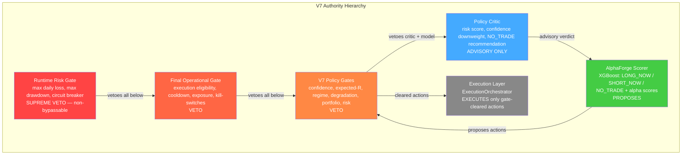
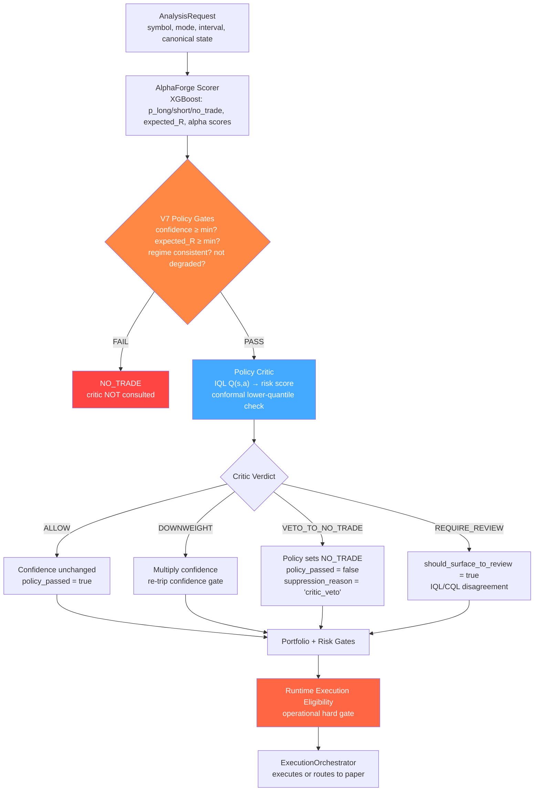
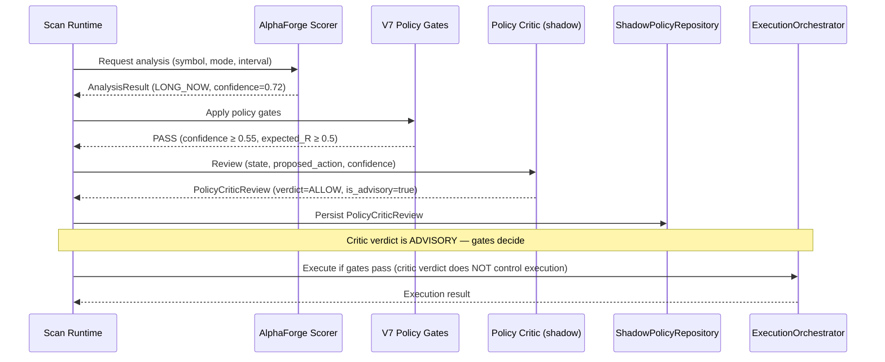
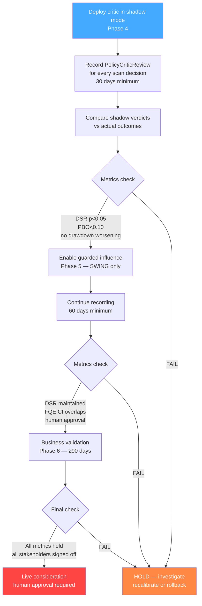

# Architecture Diagrams — V7 Policy Critic

> All diagrams use Mermaid syntax. Render with any Mermaid-compatible viewer (GitHub, VS Code, mermaid.live).

## 1. Authority Hierarchy

The critic is the **lowest authority** — it advises, gates decide.

**Key rule**: Red boxes (gates) can override the blue box (critic). The critic can never override any red box.

## 2. Data Flow — Per-Decision Pipeline

**Critical detail**: When the critic says VETO_TO_NO_TRADE, **V7 policy enacts the veto** — the critic does not directly change `recommended_action`. The verdict is recorded in `runtime_interpretation.suppression_reason`.

## 3. Phase Rollout — Evidence-Gated Progression

```mermaid
graph LR
    P0["Phase 0<br/>Docs & Design<br/>← WE ARE HERE"] -->|"docs approved<br/>partner sign-off"| P1
    P1["Phase 1<br/>Contract & Schema"] -->|"schema validated<br/>registry entry"| P2
    P2["Phase 2<br/>Replay Buffer"] -->|"≥1000 tuples<br/>no leakage"| P3A
    P3A["Phase 3A<br/>V2 Supervised"] -->|"DSR p<0.05<br/>PBO<0.10"| P3B
    P3B["Phase 3B<br/>OPE/FQE"] -->|"FQE CI overlaps"| P3C
    P3C["Phase 3C<br/>V3 IQL Critic"] -->|"Bellman stable<br/>CQL bounded"| P4
    P4["Phase 4<br/>Shadow Runtime"] -->|"30 days stable<br/>zero influence"| P5
    P5["Phase 5<br/>Guarded Influence"] -->|"60 days<br/>human approval"| P6
    P6["Phase 6<br/>Business Validation"] -->|"≥90 days<br/>all metrics held"| LIVE
    LIVE["Live Consideration<br/>human approval required"]

    style P0 fill:#44aaff,color:#fff
    style LIVE fill:#ff4444,color:#fff
```

**Each transition requires evidence.** No phase may begin before predecessor exit criteria are met. Human approval is required for Phase 5+.

## 4. Shadow-Mode Lifecycle

**Critical invariant**: The critic verdict is persisted for audit but does NOT control the execution path. Execution follows gate decisions, not critic recommendations. During shadow mode, even VETO_TO_NO_TRADE verdicts do not block execution.

## 5. Business Validation Loop

**The loop never shortcuts.** Shadow evidence must precede influence. Influence evidence must precede live consideration. Failure at any gate returns to shadow-only mode.
