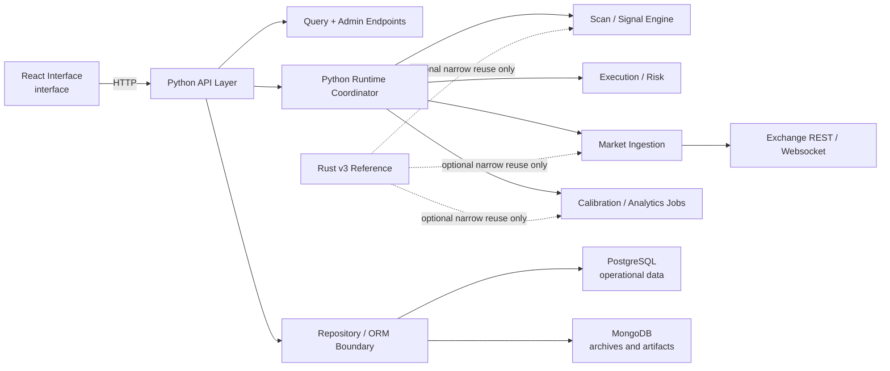

# V4 Architecture

## Summary

`v4` keeps the existing React interface and replaces the Rust-first `v3` runtime with a Python-first backend and engine runtime.

The operational rule is simple:

- one backend authority
- one runtime authority
- one persistence boundary

Rust `v3` is not removed from the repository, but it is not the main runtime path.

## Primary Goals

- Make the system operable locally without multi-process ambiguity.
- Keep the interface investment.
- Persist operational state reliably in PostgreSQL.
- Keep artifacts and archives in MongoDB.
- Make startup, recovery, and debugging predictable.

## Component Map

## Ownership

### Python owns

- API routes consumed by the interface
- runtime settings
- scan orchestration
- order execution orchestration
- portfolio state
- storage import/export/archive/restore flows
- startup and diagnostics

### PostgreSQL owns

- runtime settings
- scan runs
- signals
- orders
- fills
- positions
- portfolio snapshots
- simulation metadata
- operator-visible operational state

### MongoDB owns

- archived operational snapshots
- signal artifacts
- simulation artifacts
- drift/calibration event history
- verbose logs or traces if retained

### React interface owns

- operator workflows
- state visualization
- storage control center
- scan, trade, portfolio, market, and admin screens

### Rust `v3` may own only if justified

- isolated analytics kernels
- isolated simulation kernels
- isolated market-data helpers

Any Rust component kept for `v4` must be optional and replaceable. It must not become the only way to run the system.

## Runtime Model

### Dev mode

- Python API starts
- Python runtime/background worker starts
- React interface runs in Vite
- interface points to Python backend

### Prod-like mode

- Python API/runtime start under one deployable service model
- built interface is served by a web tier or Python app
- health, logs, and storage status are available without shell access

## Why V3 Failed Operationally

The main issue was not language preference alone. The issue was too many simultaneous boundary changes:

- new engine language
- new runtime structure
- new API authority
- new market-data path
- new storage composition
- new UI/backend contracts

That created a system that was expensive to start, inspect, and trust.

`v4` deliberately avoids that by keeping the interface and simplifying the backend/runtime authority.

## Migration Rules

### Keep

- existing React routes and UI concepts
- storage management page
- clearer backend contracts
- PostgreSQL/MongoDB role split

### Rebuild

- runtime orchestration
- API query composition
- scan execution path
- market ingestion path
- execution and portfolio persistence path

### Defer

- broad Rust-first rewrites
- multi-service runtime topologies unless clearly needed
- optional performance rewrites before product stability

## Operational Standards

`v4` is only acceptable if all of the following are true:

- local startup is understandable
- a failed dependency is obvious from logs
- a scan persists visible state
- restart does not erase operational truth
- operators can tell whether they are looking at live or seeded state
- destructive storage actions have visible status and recovery paths
